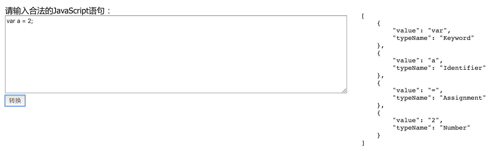

# spider

词法分析器

# 原理

通过状态转换图(transition diagram)解析字符串，生成词法单元Token的线性结构

暂支持识别：

- 关键字
- 标识符
- 数字
- 赋值
- 比较运算符
- 字符串
- 分隔符`,` `;`等

状态转换图见：`./docs/images`目录

# 开发

- 安装依赖:`yarn`
- 启动：`yarn start`

新增token识别：

在`src/lexeme/td-analysisi`添加 `新toke的状态转换图`的代码实现